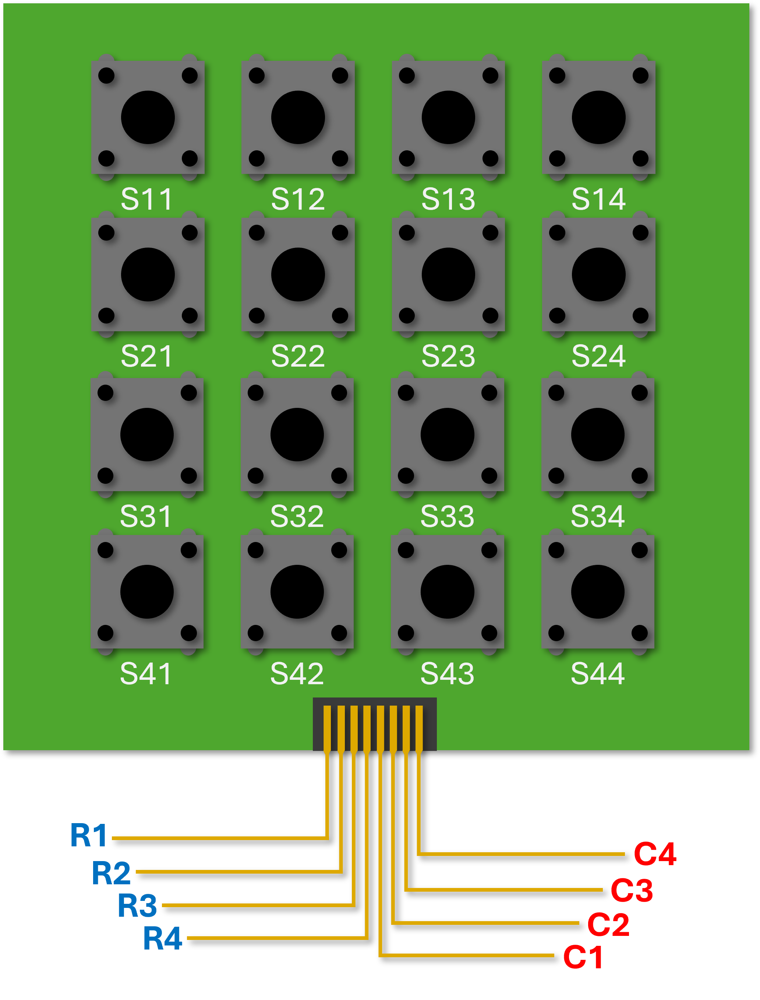

# Matrix Keypad Project
_Last Update: November 11, 2025_

## Background
This is a simple project I started when I saw a matrix keypad in my Arduino Kit. The initial idea I have is to build an "instrument" where pressing the keys creates sound, and both the RGB LED module and matrix tube would show visualizations. It was a fancy idea, but far from completion if I could not even set up the keypad. I did not also know where the breadboard was; however, I was really curious as to how it would be done.

The solution I came up with was to involve some circuit simulation. Once I would have the simulation, I could use this information to create signals that I could feed to Arduino, as if I were doing a test bench for VHDL.

<b>Figure 1.</b> Illustration of the matrix keypad with the connections I adopted from [<a href = "https://www.circuitbasics.com/how-to-set-up-a-keypad-on-an-arduino/">1</a>].

## Introduction
I have a 4x4 keypad with 8 pins as illustrated in Fig. 1, which I do not know the specifications or type. My Arduino kit only shows "Key Board 1PCS". Since I wanted to test it but I did not have the necessary electronic parts for connections, I decided to perform simulations first. I also though that performing simulations and test bench could save me time for developing the codes later as I would just have to connect everything and see if it works.

My assumption is that the keypad is a matrix of switches, and the connections I have followed is given below:

<b>Figure 2.</b> Circuit schematic of the keypad switches arranged in a 4x4 matrix. The blue lines correspond to rows while the red ones correpond to columns (Adopted from [<a href = "https://circuitdigest.com/microcontroller-projects/interface-4x4-membrane-keypad-with-arduino">1</a>]).

I saw this "1-Wire Keypad Interface With Arduino" from [2](https://www.electronicwings.com/arduino/4x4-keypad-interfacing-with-arduino-uno), and I wanted to challenge myself to design a circuit that determines which key is pressed only from a single output. This is what I ended up with:

<b>Figure 3.</b> Schematic of the single output keypad circuit. The row connections are in series, and so are the columns, with the output measured at node C1.

Since I intended to use a single output, I had to test whether there would be different voltages corresponding to pressing each individual key. 

## Simulation
I performed a simulation in LTspice with the circuit as follows:

<b>Figure 4.</b> LTspice schematic of Fig.3 for circuit simulation.

As can be seen from Fig. 4, the switches are voltage controlled. In order to check the output due to pressing each individual key, I created a set of pulsed switch voltage sources (SVS) as follows:

<b>Figure 5.</b> Pulse voltages for each switch/key.

Each switch turns **ON** when its corresponding switch voltage is more than the threshold. Before proceeding, it should be noted that I performed transient simulation, which shows the evolution of the output over time. In order to view the characteristic output of each pressed key, I had to turn an SVS within some specific time, then turn it **OFF** for the rest of the simulation to turn **ON** the others, allowing to study their corresponding voltage outputs. Hence, voltages sources in Fig. 4 are pulsed.

For each SVS, it pulses at 5 V during a 0.5-s interval, indicating that is **ON**. At the start of the simulation, S11 from Fig. 1 turns ON for 0.5 s, and turns off until the end. After 0.5 s when S11 switches off, S12 turns on also for another 0.5 s. The other switches follows the same timing, starting from left to right, top to bottom. The result of the simulation is given as follows:

<b>Figure 6.</b> Pulse timing of each switch/SVS (<i>bottom</i>) and the resulting measured output <i>Vout</i> (<i>top</i>). The output characteristics is divided into four regions according to their row locations. <i>Vout</i> of each pressed key corresponds to the height of the bar.

From the data of Fig. 6, the _Vout_ of the following switches are as follows:
<table align = "center">
  <thead>
  <tr>
    <th class = "empty"></th>
    <th align = "center">Switch/Key</th>
    <th align = "center"><i>Vout</i> [mV]</th>
  </tr>
  </thead>

  <tbody>
  <tr>
    <th rowspan = "4">Row 1</th>
    <td align = "center">S11</td>
    <td align = "center">4775.5</td>
  </tr>

  <tr>
    <td align = "center">S12</td>
    <td align = "center">2442.6</td>
  </tr>

  <tr>
    <td align = "center">S13</td>
    <td align = "center">1640.9</td>
  </tr>

  <tr>
    <td align = "center">S14</td>
    <td align = "center">1235.5</td>
  </tr>

  <tr>
    <th rowspan = "4">Row 2</th>
    <td align = "center">S21</td>
    <td align = "center">4571.1</td>
  </tr>

  <tr>
    <td align = "center">S22</td>
    <td align = "center">2388.0</td>
  </tr>

  <tr>
    <td align = "center">S23</td>
    <td align = "center">1616.1</td>
  </tr>

  <tr>
    <td align = "center">S24</td>
    <td align = "center">1221.4</td>
  </tr>

  <tr>
    <th rowspan = "4">Row 3</th>
    <td align = "center">S31</td>
    <td align = "center">4385.5</td>
  </tr>

  <tr>
    <td align = "center">S32</td>
    <td align = "center">2335.8</td>
  </tr>

  <tr>
    <td align = "center">S33</td>
    <td align = "center">1592.0</td>
  </tr>

  <tr>
    <td align = "center">S34</td>
    <td align = "center">1207.5</td>
  </tr>

  <tr>
    <th rowspan = "4">Row 4</th>
    <td align = "center">S41</td>
    <td align = "center">4210.7</td>
  </tr>

  <tr>
    <td align = "center">S42</td>
    <td align = "center">2285.8</td>
  </tr>

  <tr>
    <td align = "center">S43</td>
    <td align = "center">1568.7</td>
  </tr>

  <tr>
    <td align = "center">S44</td>
    <td align = "center">1194.0</td>
  </tr>
  
  </tbody>
</table>

<b>Table 1.</b> Corresponding <i>Vout</i> for each switch/key measured from the LTspice simulation.

## Implementation
Now that I have identified the output of each key, I can now tell Arduino which key is pressed based on the analog signal it measures. Arduino UNO board, on the other hand, uses the 8-bit ATMEGA328P microcontroller. However, during my initial trial, I assumed 10-bit instead of 8-bit. In any case, this means that the digitization process goes in discrete steps calculated as follows

$$\displaystyle \Delta_{\text{step}} = \frac{V_{\text{max}} - V_{\text{min}}}{2^{n} - 1}$$

where $n$ is the number of bits and ($V_{\text{max}}$, $V_{\text{min}}$) is the voltage range of interest. I assumed that in the real case where I measure the actual output node, I might not get the exact $4775.5$ mV for S11. It might fluctuate, so I tried to create a range based on the step calculated using 10 bits. However, upon realizing that it's 8 bit, there are ranges that overlap. I just assume that the fluctuations may be insiginificant, and I can set arbitrary ranges around the measured _Vout_ in Table 1.

# References
[1] [https://www.circuitbasics.com/how-to-set-up-a-keypad-on-an-arduino/](https://www.circuitbasics.com/how-to-set-up-a-keypad-on-an-arduino/).

[2] [https://circuitdigest.com/microcontroller-projects/interface-4x4-membrane-keypad-with-arduino](https://circuitdigest.com/microcontroller-projects/interface-4x4-membrane-keypad-with-arduino).

[3] [https://www.electronicwings.com/arduino/4x4-keypad-interfacing-with-arduino-uno](https://www.electronicwings.com/arduino/4x4-keypad-interfacing-with-arduino-uno).
